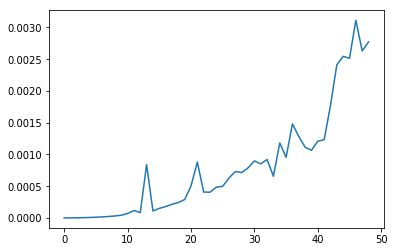

### Questions
* Is NetworkX used in deep learning? No
* The strategy to find the shortest path from one node to another
    * Least number of edges from one node to another

### Objectives
YWBAT 
* define a complete graph
* give examples of when to use graph theory
* how is graph theory used today

### Why is calculating/estimating edge numbers so important for computational studies?
How many flops your code is going to do

**flops** -> number of floating point operations per second -> algorithm efficiency

**Big O** Notation
* O(1) - constant time
* O(n) - linear time
* O(nlogn) - n-logn time
* O(n^2) - n^2 time
* O(n^3) - n^3 time


```python
# Example of O(n)
def first(arr):
    return arr[0] + arr[1]


# Big(O) = n
def cap(arr):
    cap_arr = []
    for word in arr:
        cap_arr.append(word.capitalize())
    return cap_arr


# Big(0) = O(cap_back) = n
# flops = 2n
def cap_back(arr):
    cap_back_arr = []
    
    for word in arr:
        cap_back_arr.append(word[::-1])
    
    for index, word in enumerate(cap_back_arr):
        cap_back_arr[index] = word.capitalize()
    
    return cap_back_arr


# O(n^2)
def f(arr):
    f = []
    for word1 in arr:
        for word2 in arr:
            if word1 == word2:
                continue
            if word1[0] == word2[0]:
                f.append((word1, word2))
    return f


# how could we write an 0(n^3)
# 3 nested for loops
```


```python
import time
time.time()
```


    1561135885.74135


```python
def f3(arr):
    p = 1
    for i in arr:
        for i in arr:
            for i in arr:
                p = 2
    return None

def f2(arr):
    p = 1
    for i in arr:
        for i in arr:
            p = 2
    return None


def f1(arr):
    p = 1
    for i in arr:
        p = 2
    return None
```


```python
t1, t2, t3 = [], [], []

for i in range(1, 50):
    arr = list(range(i))
    
    start = time.time()
    f1(arr)
    t1_ = time.time() - start
    
    t1.append(t1_)
    
    start = time.time()
    f2(arr)
    t2_ = time.time() - start
    t2.append(t2_)
    
    start = time.time()
    f3(arr)
    t3_ = time.time() - start
    
    t3.append(t3_)
```


```python
plt.plot(range(len(t3)), t3)
```


    [<matplotlib.lines.Line2D at 0x11a16f978>]





### How are graphs used?
* Networks
    * Finding people really close together
        *  connect users on purchase history 
        *  connect user demographical 
* Recommender Systems
    * 1 graph (grid) of users
    * 1 graph (grid) of items/movies/songs
    * find similar users and find what 1 user likes and recommend to the other

* Neural Networks
    * Layers - nodes
    * Layers are connected by edges
    * Talk more later
    
* PGMs - Probabilistic Graphical Models
    * super super fast compared to ML models
    * Markov Chains
        * connect items based on frequency
    * PGMs are really defined by the edges they use
        * Using Poisson Distributions
        * Normal Distribution
        * Beta Distribution

### Outline


```python
import pandas as pd
import numpy as np

import matplotlib.pyplot as plt
```

### Assessment
